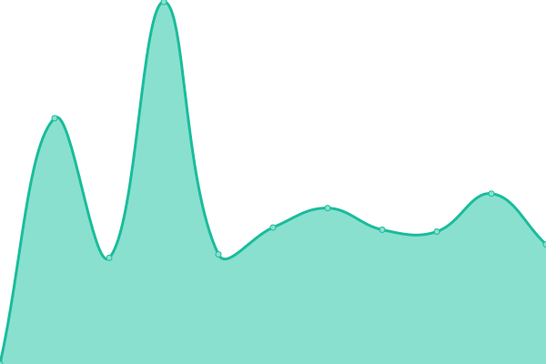

# [📈 Live Status](https://demo.upptime.js.org): <!--live status--> **🟧 Partial outage**

This repository contains the open-source uptime monitor and status page for [Lio](https://demo.upptime.js.org), powered by [Upptime](https://github.com/upptime/upptime).

With [Upptime](https://upptime.js.org), you can get your own unlimited and free uptime monitor and status page, powered entirely by a GitHub repository. We use [Issues](https://github.com/Lio/upptime/issues) as incident reports, [Actions](https://github.com/Lio/upptime/actions) as uptime monitors, and [Pages](https://demo.upptime.js.org) for the status page.

<!--start: status pages-->
<!-- This summary is generated by Upptime (https://github.com/upptime/upptime) -->
<!-- Do not edit this manually, your changes will be overwritten -->
<!-- prettier-ignore -->
| URL | Status | History | Response Time | Uptime |
| --- | ------ | ------- | ------------- | ------ |
|  [bcn.cat](https://bcn.cat) | 🟩 Up | [bcn-cat.yml](https://github.com/elemilio/uptime_lio/commits/HEAD/history/bcn-cat.yml) | 

 2547ms
     
 | 

<a href="https://elemilio.github.io/uptime_lio/history/bcn-cat">98.35%</a>
    

|  [Espaidocs (Owncloud)](https://espaidocs.bcn.cat) | 🟥 Down | [espaidocs-owncloud.yml](https://github.com/elemilio/uptime_lio/commits/HEAD/history/espaidocs-owncloud.yml) | 

 8399ms
     
 | 

<a href="https://elemilio.github.io/uptime_lio/history/espaidocs-owncloud">90.90%</a>
    

|  [Comunitats (HumHub)](https://comunitats.bcn.cat/index.php?r=user%2Fauth%2Flogin) | 🟩 Up | [comunitats-hum-hub.yml](https://github.com/elemilio/uptime_lio/commits/HEAD/history/comunitats-hum-hub.yml) | 

 1096ms
     
 | 

<a href="https://elemilio.github.io/uptime_lio/history/comunitats-hum-hub">95.40%</a>
    

|  [GitLab DTI](https://gitlab.dtibcn.cat/users/sign_in) | 🟩 Up | [git-lab-dti.yml](https://github.com/elemilio/uptime_lio/commits/HEAD/history/git-lab-dti.yml) | 

 670ms
     
 | 

<a href="https://elemilio.github.io/uptime_lio/history/git-lab-dti">100.00%</a>
    

|  [El Digital](https://eldigital.barcelona.cat/wp-admin) | 🟩 Up | [el-digital.yml](https://github.com/elemilio/uptime_lio/commits/HEAD/history/el-digital.yml) | 

 2389ms
     
 | 

<a href="https://elemilio.github.io/uptime_lio/history/el-digital">100.00%</a>
    

|  [Districtes (Sant Martí)](https://ajuntament.barcelona.cat/santmarti/ca) | 🟩 Up | [districtes-sant-marti.yml](https://github.com/elemilio/uptime_lio/commits/HEAD/history/districtes-sant-marti.yml) | 

 1145ms
     
 | 

<a href="https://elemilio.github.io/uptime_lio/history/districtes-sant-marti">100.00%</a>
    

|  [www.barcelona.cat (CONTINGUTS)](https://continguts-www.barcelona.cat/ca) | 🟩 Up | [www-barcelona-cat-continguts.yml](https://github.com/elemilio/uptime_lio/commits/HEAD/history/www-barcelona-cat-continguts.yml) | 

 1444ms
     
 | 

<a href="https://elemilio.github.io/uptime_lio/history/www-barcelona-cat-continguts">100.00%</a>
    

|  [API Casaments](https://api-casaments.bcn.cat/node.json?type=disponibilitat%26field_districte=4%26load-entity-refs=node%2Cfile%2Ctaxonomy_term%26max-depth=1) | 🟩 Up | [api-casaments.yml](https://github.com/elemilio/uptime_lio/commits/HEAD/history/api-casaments.yml) | 

 849ms
     
 | 

<a href="https://elemilio.github.io/uptime_lio/history/api-casaments">95.92%</a>
    

|  [BCN Cultura](https://www.barcelona.cat/barcelonacultura/ca) | 🟩 Up | [bcn-cultura.yml](https://github.com/elemilio/uptime_lio/commits/HEAD/history/bcn-cultura.yml) | 

 728ms
     
 | 

<a href="https://elemilio.github.io/uptime_lio/history/bcn-cultura">100.00%</a>
    

|  [BCN El Digital](https://eldigital.barcelona.cat/admin-wp) | 🟩 Up | [bcn-el-digital.yml](https://github.com/elemilio/uptime_lio/commits/HEAD/history/bcn-el-digital.yml) | 

 712ms
     
 | 

<a href="https://elemilio.github.io/uptime_lio/history/bcn-el-digital">100.00%</a>
    

<!--end: status pages-->

[**Visit our status website →**](https://demo.upptime.js.org)

## 📄 License

- Powered by: [Upptime](https://github.com/upptime/upptime)
- Code: [MIT](./LICENSE) © [Lio](https://demo.upptime.js.org)
- Data in the `./history` directory: [Open Database License](https://opendatacommons.org/licenses/odbl/1-0/)
